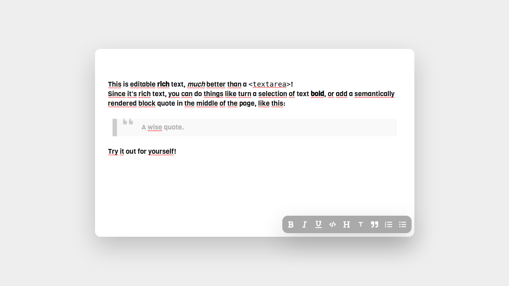

<h1 align="center">Welcome to Fast Rich 👋</h1>
<p>
  
  <a href="/LICENSE" target="_blank">
    
  </a>
</p>

> The Fast Rich-Text Editor



## Install

```sh
yarn
```

## Usage

```sh
yarn run start
```

## Run tests

```sh
yarn run test
```

## Author

👤 **Matheus Lima**

* Website: https://www.gitshowcase.com/kowalsk1-wq
* Github: [@Kowalsk1-wq](https://github.com/Kowalsk1-wq)
* LinkedIn: [@hugo-lima](https://linkedin.com/in/hugo-lima)

## Show your support

Give a ⭐️ if this project helped you!

## 📝 License

Copyright © 2020 [Matheus Lima](https://github.com/Kowalsk1-wq).<br />
This project is [MIT](/LICENSE) licensed.

***
_This README was generated with ❤️ by [readme-md-generator](https://github.com/kefranabg/readme-md-generator)_